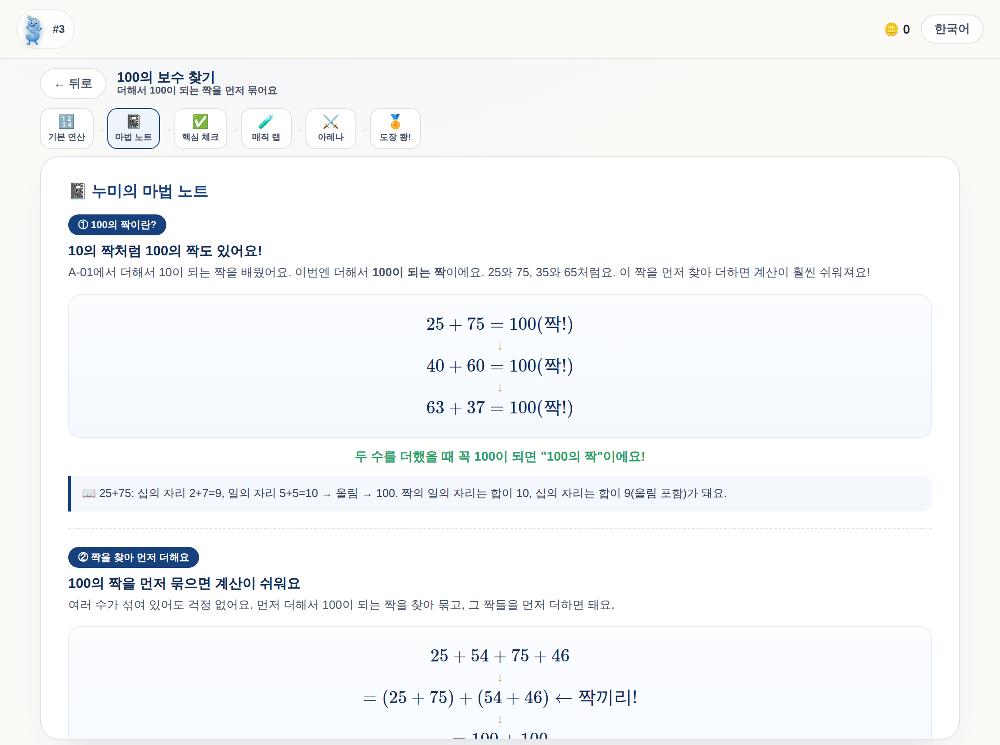
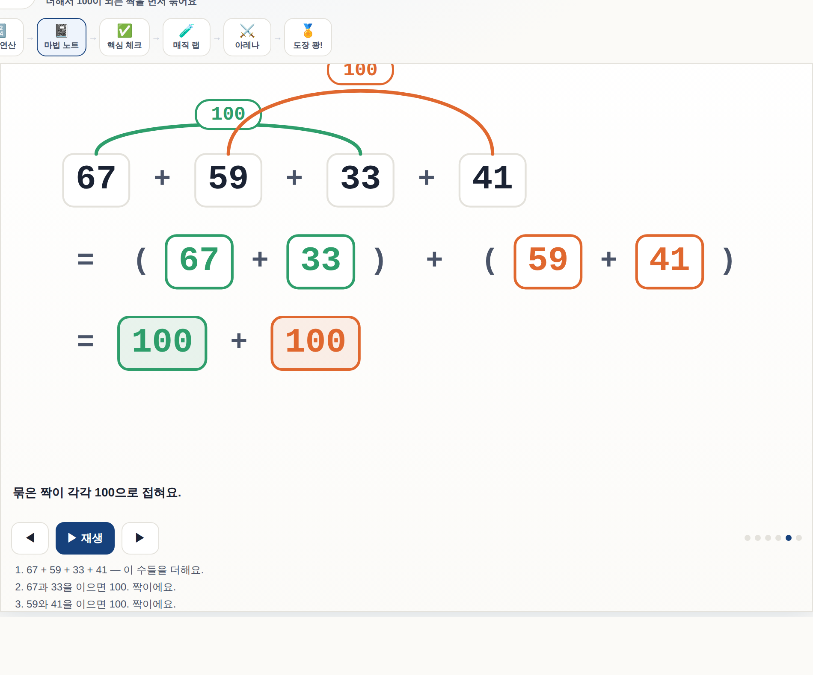

# Concept Whiteboard Lesson

개념을 **빈 칠판에 순서대로 그려 가며** 가르치는 애니메이션 강의를 만드는 GFIELD 자체 스킬입니다.

완성된 그림에 색을 입히는 방식이 아닙니다. 아이가 완성본을 보고 강조가 켜지는 걸 보면 **결과는 배우지만 다음에 뭘 해야 하는지는 못 배웁니다.** 개념은 순서 자체가 내용이기 때문입니다.

## 왜 필요한가 — 실제 화면

**A-05 「100의 보수 찾기」의 현재 개념 화면입니다.** 이 유닛이 가르치는 마법은
`25+54+75+46` 에서 **짝을 찾아 묶는 동작**인데:



`= (25 + 75) + (54 + 46) ← 짝끼리!` 한 줄이 전부입니다. **어느 수와 어느 수가 왜 짝인지,
그것을 어떤 순서로 찾는지는 아이가 머릿속에서 상상해야 합니다.** 결과는 보이지만 절차는 보이지
않습니다.

이 저장소의 유닛 **187개 중 186개가 이 상태**입니다 — `mathSteps`라는 문자열 배열, 그림 없음.
그림을 그리는 유닛은 1개뿐입니다.

### 적용 후

같은 유닛, 같은 자리입니다. 짝을 **찾아 잇고 → 100으로 접는** 과정이 순서대로 그려집니다.


호가 짝을 **찾아 잇고**, 아래 줄에서 괄호로 **묶이고**, 다시 각각 `100`으로 **접힙니다.**
어느 수가 왜 짝인지, 어떤 순서로 찾는지가 화면에 있습니다 — 빈 칠판에서 하나씩 그려지므로
**한 번에 새로 나타나는 것은 언제나 하나**입니다.

수는 매번 새로 생성되므로 이건 한 예시입니다. 장면은 유닛의 산문이 아니라 **생성기가 내보낸
값**에서 만들어집니다.

<details><summary>정지 화면으로 보기 (마지막 상태 — 인쇄물에 나가는 그림)</summary>



인쇄물에는 애니메이션이 없으므로 **마지막 한 장이 그 자체로 설명이 되어야** 합니다.
그것이 이 스킬의 완료 기준 중 하나입니다.

</details>

원본 화질: [18초 MP4](assets/demo-a05.mp4)

> 대표 3개(A-05 묶기 · C-06 자리 이동 · M-11 표기 바꾸기)를 먼저 만들어 판단한 뒤 확장합니다.
> 나머지 다섯 계열(이사·쪼개기·보정·부분곱·무지개)은 아직입니다.

캡처는 손으로 찍지 않고 스크립트로 다시 뽑습니다. 유닛이 바뀌면 README의 그림도 같이 갱신해야
하는데, 그러지 않으면 **이 스킬이 잡으려는 결함(화면과 설명이 어긋남)을 스킬 자신이 저지르게**
됩니다.

```bash
node scripts/capture-demo.js before A-05   # 지금 상태
node scripts/capture-demo.js after  A-05   # 적용 후
node scripts/capture-demo.js video  A-05   # 시연 영상 (webm → mp4)
```

## 두 스킬을 합친 것입니다

| 가져온 것 | 어디서 |
|---|---|
| **교수 방식** — 점진적 구성, beat당 하나, 학습자 조작 | `english-math-whiteboard-lesson` |
| **엔지니어링** — 장면 계약, 안정 id, 권리 경계, 출시 게이트, 검증기 | `gmap-animated-math-lesson` |

## 무엇을 다루나

- **개념** — 창의수연 전략 유닛(짝 묶기·수 이사·쪼개기·자리 이동 …), 중고등 기호 도입
- **풀이 보기** — 같은 장치로 만듭니다. 풀이는 같은 전략을 구체적인 수로 수행하는 것이라, 생성기의 `steps`가 그대로 beat가 되어 **문항당 저작 비용이 0**입니다. 여는 시점은 **한 번 틀린 뒤**

## 핵심 원칙 다섯

1. **장면은 생성기 데이터에서 나온다** — 손으로 그리지 않고, **TeX를 파싱하지 않습니다**(표기가 바뀌면 조용히 깨짐). 생성기에 `scene:{}`를 덧붙입니다
2. **좌표는 계산한다** — 눈대중 금지. 기존 렌더러(`geometry/worksheet/render.js`)를 재사용합니다
3. **beat당 새로 그려지는 것은 하나** — 이게 곧 "볼 곳이 하나"를 만듭니다
4. **자막이 원본** — 화면 자막·인쇄 설명·음성 대사가 같은 텍스트. 3개 언어를 각각 직접 씁니다
5. **마지막 한 장이 스스로 설명해야 한다** — 인쇄물에는 애니메이션이 없습니다

## 음성은 3단 체인입니다

"브라우저 음성"이 아닙니다. 문장 자체를 키로 하는 사전 녹음 MP3 → Web Speech(`ko-KR`/`en-US`/`zh-CN`) → 무음.

**id가 아니라 텍스트를 키로 쓰는 것이 중요합니다.** 문장을 고치면 키가 안 맞아 현재 텍스트를 읽는 쪽으로 떨어집니다. id를 키로 쓰면 옛 녹음이 계속 맞아 화면과 다른 말을 합니다.

기본은 **자막만 쓰고 무료 계층으로 출시**입니다. 유료 녹음은 문구가 확정된 뒤에만 얹습니다 — 진짜 비용은 생성비가 아니라 **재생성비**입니다.

## 완료 기준 아홉

PC·모바일·**A4** / 원본 구조(보존식) / **시선** / **단일 정답** / 재생·조작 /
**학습자 적합(`learner-fit`)** / **관측 가능성** / **오답 설계와 정답 형태** / **역검사**

마지막이 핵심입니다. **"검사가 통과했다"가 아니라 "검사가 실패할 수 있음을 보인 뒤 통과했다"**가 기준입니다. 이 저장소는 실패할 수 없는 검사기를 두 번 통과시킨 적이 있습니다 — 인쇄 CSS가 꺼진 채 돈 칸 넘침 검사, 식 틀을 읽지 않고 가정한 유일해 검사. 둘 다 초록불이었습니다. 그래서 **역검사**(고의로 깨뜨려 검사가 빨간불이 되는지 확인한 뒤 되돌리기)를
다른 게이트보다 먼저 돌립니다.

**만드는 쪽이 스스로를 승인할 수 없습니다.** 검증하는 쪽에는 과제 계약·출처 위치·게이트 목록·산출물을
주되 **"다 통과했다"는 구현자의 자기보고는 주지 않습니다.** 그리고 **작업·증거·출시는 다른 축**입니다 —
게이트를 통과하면 *출시 가능(eligible)*일 뿐, 승인도 배포도 아닙니다.

## 더 큰 파이프라인 안에 있습니다

이 스킬은 **강의 하나를 만들고 검증하는 것**만 다룹니다. 그 바깥 —
과제 계약, 중복 작업 차단, 증거 라우팅, 모델·에이전트 배분, 출시 상태, 이어받기 —
는 **`evidence-gated-learning-pipeline`** (`docssam1/source-to-memory`,
`skill/evidence-gated-learning-pipeline`)의 몫입니다. 수학 작업 전에는 그쪽
`references/math.md`를 먼저 읽습니다. 위 원칙 2(좌표 계산·기존 렌더러 재사용)가
거기서 온 규칙입니다.

그쪽이 이름을 대는 보조 스킬 두 개(`gfield-single-answer-visibility`,
`iterate-until-verified`)가 **설치돼 있지 않으면 받아오지 말고**, 같은 수준의
결정성·관측성·반복 게이트를 적용하라는 것이 그쪽 자신의 지시입니다 —
`references/verification.md`가 그 자리를 대신합니다.

## 설치

### Claude Code

저장소 안에서 쓰면 별도 설치가 필요 없습니다 — `skills/` 아래 있으면 인식됩니다.

전역으로 쓰려면 사용자 스킬 폴더에 복사합니다:

```bash
cp -r skills/concept-whiteboard-lesson ~/.claude/skills/
```

Windows:

```powershell
Copy-Item -Recurse skills\concept-whiteboard-lesson $env:USERPROFILE\.claude\skills\
```

### Codex (GPT)

`agents/openai.yaml`이 들어 있어 그대로 인식됩니다. Codex 스킬 폴더에 복사하세요:

```powershell
Copy-Item -Recurse skills\concept-whiteboard-lesson E:\Codex\skills\
```

호출: `$concept-whiteboard-lesson`

## 구성

```
SKILL.md                          진입점 — 원칙과 게이트
agents/openai.yaml                Codex 인터페이스
references/
  motion-families.md              동작 계열 8종 + 생성기 대응 + 보존식
  scene-contract.md               G·MAP 계약 대비 델타만
  narration-and-voice.md          3개 언어 + 음성 3단 체인 + 계층 선택 규칙
  verification.md                 게이트 9개 · 역검사 방법 · 승인 주체
```

`gmap-animated-math-lesson`의 검증기(`scripts/validate_scene_manifest.py`)는 구조 규칙을 그대로 검사하므로 **함께 돌립니다.** 이 스킬은 델타만 기록합니다.

## 원본과 다르게 간 곳 하나

`english-math-whiteboard-lesson`은 **오디오 타이밍이 척추**입니다. 그건 그쪽이 **영어** 수업이라 말해지는 문구 자체가 배울 내용이기 때문입니다.

우리는 매체가 아니라 **수학이 내용**이라 뒤집었습니다:
- 수학은 **다시 읽습니다** — 자막은 남고 소리는 지나갑니다
- **A4로도 나갑니다** — 종이에는 타이밍 척추가 의미 없습니다
- 아이가 **한 단계에서 멈춰 생각**할 수 있어야 하는데, 시계 기반 진행은 그걸 방해합니다

그래서 자막이 척추이고 오디오가 그 위에 얹힙니다.
