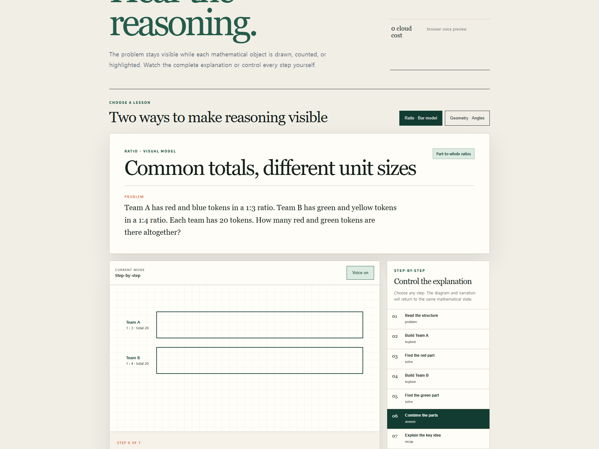
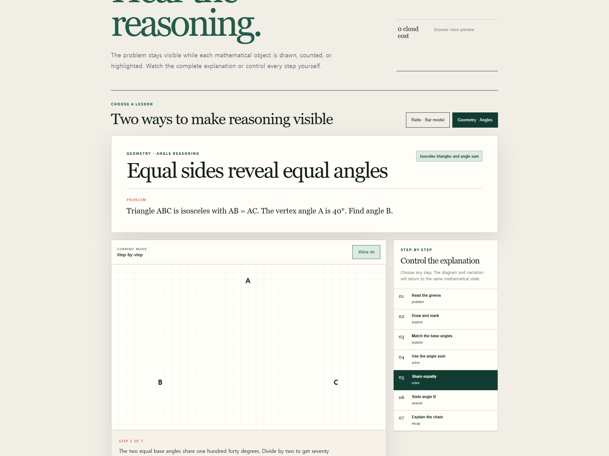

# G·MAP Animated Math Lesson

G·MAP은 수학 문제를 단순한 텍스트 풀이가 아니라 **문제 → 그림 → 추론 → 답**의 순서로 보이게 만드는 GFIELD 자체 제작 강의 스킬입니다.

문제의 중요한 대상을 장면 객체로 등록하고, 각 설명 문장과 객체를 연결합니다. 같은 장면 데이터에서 전체 재생, 단계별 학습, 최종 정리, 교사용 발문을 함께 생성하므로 설명과 그림이 어긋나지 않습니다.

## 실제 사용 화면

아래 자료는 G·MAP 공개 강의 페이지에서 실제 버튼을 눌러 캡처한 결과입니다.





[14-second visual usage demo (MP4)](assets/gmap-animated-lesson-demo.mp4)

라이브 페이지: [G·MAP Animated Math Lessons](https://lete-on.gfieldacademy.net/boarding-school-math/animated-math.html)

## 핵심 기능

- 막대모형 칸별 그리기와 단위값 강조
- 도형의 변·같은 변 표시·각 호·밑각 강조
- 전체 재생과 이전·다음 단계별 학습
- 현재 설명 문장, 진행률, 전체 transcript
- 브라우저 음성 켜기/끄기와 음성 없이 학습하기
- 최종 풀이 한눈에 보기
- 교사용 오개념·질문·성공 기준
- 모바일 레이아웃과 `prefers-reduced-motion` 대응
- 답 유일성·좌표·장면 대상·공개 권리 검증

## 빠른 시작

1. [SKILL.md](SKILL.md)의 공개·비공개 자료 경계를 읽습니다.
2. [scene-contract.md](references/scene-contract.md)로 장면 manifest를 작성합니다.
3. [archetypes.md](references/archetypes.md)에서 가장 작은 표현 유형을 선택합니다.
4. 검증기를 실행합니다.

```bash
python scripts/validate_scene_manifest.py examples/common-total-ratio.scene.json
python scripts/validate_scene_manifest.py examples/isosceles-angle.scene.json
```

5. 답이 확정되지 않았거나 원문 권리가 확인되지 않은 장면은 `locked` 상태로 둡니다.

## 제공 예제

- `examples/common-total-ratio.scene.json`: 1:3과 1:4의 공통 전체량을 막대모형으로 설명하고 `5 + 4 = 9`를 검산합니다.
- `examples/isosceles-angle.scene.json`: 이등변삼각형의 같은 변과 밑각을 표시한 뒤 `(180 - 40) ÷ 2 = 70`을 설명합니다.

두 예제는 GFIELD 자체 제작 자료이며 외부 대회 원문이나 스캔을 포함하지 않습니다. 실제 대회 문항은 원문·그림·공식 답·공개 권리를 별도로 확인한 뒤 공개 여부를 결정합니다.

## 장면 원칙

```text
one verified scene
       ├── full playback
       ├── step-by-step study
       ├── final overview
       └── teacher evidence
```

시각 효과가 수학적 상태를 대신하지 않습니다. 객체가 먼저 확정되고, 애니메이션은 그 객체를 그리거나 강조하는 역할만 합니다.
